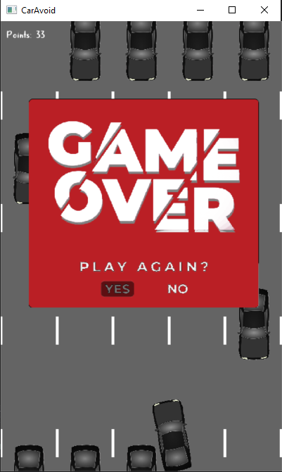

# Car-Avoid-Game
Game made with SFML where you drive a car and try to avoid obstacles.

In game your drive a car. Car can turn left, right and shoot. You have to avoid obstacles, that are generated randomly on one of five track. Road have five tracks. Your goal is to earn as much points as possible. Getting more points will lvl up difficulty lvl. With that cars are spawning more frequently and they are driving faster. Your magazine can store 5 bullets, than if you are empty you have to reload.

**Steering**
left/right arrow keys - moving left/right
space button - shoot
r button - reload

